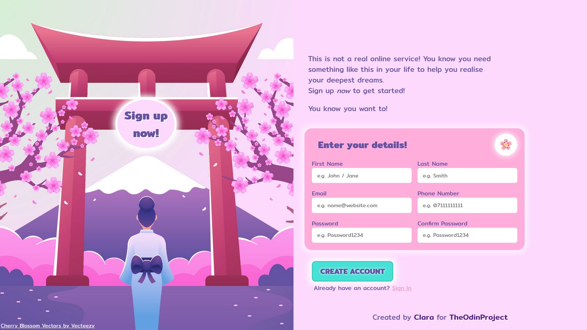

	<h1>Sign-up Form
	 
		
		
		
		 
	</h1>
	<h3><b><a href="https://clarasmyth.github.io/sign-up-form/">View Live Demo</a></b></h3>

## Description

This is a sign-up form webpage created as part of [TheOdinProject](https://www.theodinproject.com) curriculum.

To see the assignment details - [Click Here](https://www.theodinproject.com/lessons/node-path-intermediate-html-and-css-sign-up-form)

## Built Using

-   HTML5 
-   CSS3 
-   JavaScript 

## Credits

#### Icons

-   [Simple Icons](https://simpleicons.org/)
-   [Vecteezy - bilicube](https://www.vecteezy.com/vector-art/1971193-a-girl-under-the-fallen-cherry-blossoms)

## Gallery

#### Home page

